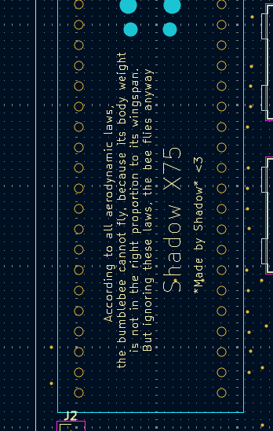

# ShadowX75
It is a 75% layout, mechanical keyboard with hot-swap sockets! A rotatory encoder and an OLED screen!  

  

I made this project because I love keyboards. This would be my second keyboard after a split one! This version runs on QMK firmware and also has a rotatory encoder with an OLED screen  

### PCB
The PCB is designed to be compatible with Cherry MX switches and features hot-swappable kalih sockets.
| Schematics |
| --- |
|  | 

| PCB (All Layers)|
| --- |
|  |

| PCB (Without the art and zones)|
| --- |
|  |

| PS : Some PCB art|
| --- |
|  |
| --- |
|  |

## Case

The case is designed to be 3D printed and features a sandwich mount design with a 5° typing angle. The bottom case, top case, plate, and knob are all designed to be printed.

| Case Full|
| --- |
|  |

| Case Exploded View|
| --- |
|  |

## BOM ( I already have the parts mentioned as self sourced )
|Name                        |Purpose                                                       |Cost (USD)|Qty|Total (USD)                      |Link           |Distributor                                                        |
|----------------------------|--------------------------------------------------------------|----------|---|---------------------------------|---------------|-------------------------------------------------------------------|
|                            |                                                              |          |   |                                 |               |                                                                   |
|Hotswap sockets             |To solder to the PCB for switches                             |$0.11     |90 |$9.90                            |[Link to Listing](https://stackskb.com/store/gateron-hotswap-sockets/)|Stackskb                                                           |
|PCB ( 5 MOQ )               |this is the main circuit board for keyboard                   |$40.00    |1  |$40.00                           |-              |JLCPCB                                                             |
|Stabilzers                  |To support the 2u and 6.25u keys                              |$0.00     |1  |$0.00                            |-              |Self sourced ( I already have the parts mentioned as self sourced )|
|Heatset inserts and Screws  |To attach the 3 bodies together                               |$0.00     |8  |$0.00                            |-              |Self sourced                                                       |
|Rotatory Encoder            |To control volume/brightness                                  |$0.00     |1  |$0.00                            |-              |Self sourced                                                       |
|OLED ( 0.91 inch )          |To display random stuff while I type                          |$0.00     |1  |$0.00                            |-              |Self sourced                                                       |
|Shipping charges            |Shipping charge to get the 3d prints ( from #printing-legion )|$6.00     |1  |$6.00                            |-              |#printing-legion                                                   |
|Pin headers ( 1x40 )        |To solder the rpi pico to the PCB                             |$0.01     |1  |$0.01                            |[Link to Listing](https://robu.in/product/2-54mm-1x40-pin-male-single-row-straight-short-header-strip-pack-of-3/)|robu.in                                                            |
|raspberry pi pico           |This is the MCU of the keyboard                               |$4.50     |1  |$4.50                            |[Link to Listing](https://robu.in/product/raspberry-pi-pico/)|robu.in                                                            |
|1N4148W SOD-123 1206 Diode  |Used for the matrix wiring in the keyboard                    |$0.01     |100|$0.92                            |[Link to Listing](https://robu.in/product/1n4148w-sod-123-1206-diodereel-of-3000/)|robu.in                                                            |
|Keycap set ( Full Keyboard )|To add on the switches                                        |$14.14    |1  |$14.14                           |[Link to Listing](https://stackskb.com/store/veekos-gradient-keycaps-cherry-profile-135-keys/?attribute_pa_colour=rose-latte)|Stackskb                                                           |
|Switches                    |To press the keys                                             |$0.26     |90 |$23.40                           |[Link to Listing](https://stackskb.com/store/akko-piano-pro-switch-pack-of-45/)|Stackskb                                                           |
|                            |                                                              |          |   |                                 |               |                                                                   |
|                            |                                                              |          |   |Total Estimated Cost (USD):$98.87|               |                                                                   |
